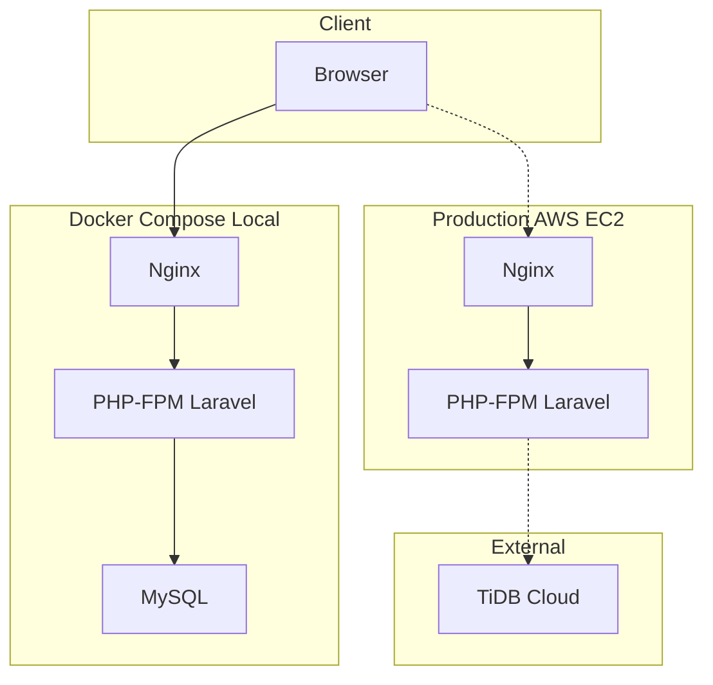
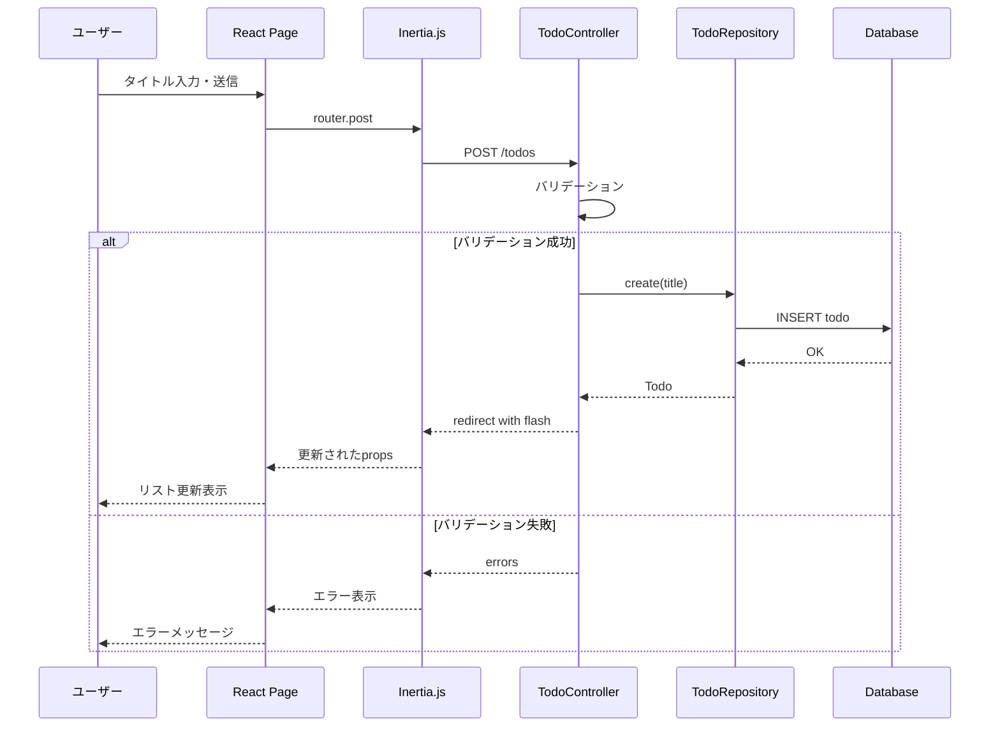
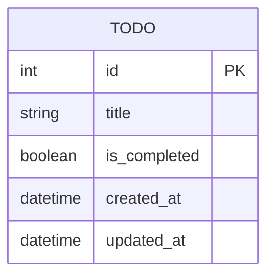
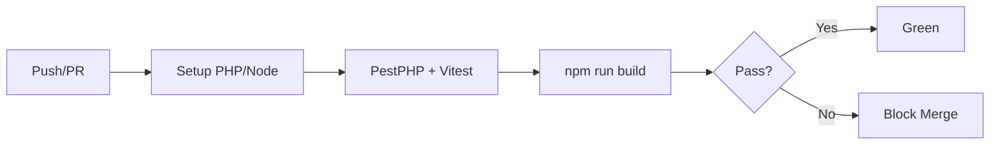

# Technical Design Document

## Overview

**Purpose**: 技術学習を目的とした最小限のTODOアプリケーション。Laravel + React + Inertia.js のフルスタック構成を実践的に習得する。

**Users**: 開発者（自分自身）がフルスタック開発、Docker、CI/CDの流れを学習する。

**Impact**: 新規プロジェクトとして、ゼロからモダンなWebアプリケーションの全レイヤーを構築する。

### Goals
- Laravel + React + Inertia.js の統合パターンを習得
- Docker Composeによる開発環境構築を理解（ローカルMySQL）
- リポジトリパターンによるDB抽象化を実践
- GitHub Actions によるCI構築を実現
- 本番環境ではTiDB Cloudに切り替え可能な設計

### Non-Goals
- 認証機能（ログイン・ユーザー管理）
- マルチユーザー対応
- TODOの編集機能
- 高可用性・スケーラビリティ
- モバイル対応

## Architecture

### Architecture Pattern & Boundary Map



**Architecture Integration**:
- **Selected pattern**: Laravel MVC + Inertia.js（モノリシックSPA）+ リポジトリパターン
- **Domain boundaries**: 単一ドメイン（TODO管理）、認証なし
- **DB Strategy**: ローカル = MySQL、本番 = TiDB Cloud（リポジトリパターンで抽象化）
- **New components rationale**: TodoRepositoryInterfaceでDB操作を抽象化
- **Steering compliance**: tech.mdで定義された技術スタックに準拠

### Technology Stack

| Layer | Choice / Version | Role in Feature | Notes |
|-------|------------------|-----------------|-------|
| Frontend | React 18+ / TypeScript 5+ | UIコンポーネント | Inertia.jsでLaravelと統合 |
| Bridge | Inertia.js 1.x | サーバー・クライアント連携 | SPAライクなUX実現 |
| Backend | Laravel 11 / PHP 8.3+ | API・ビジネスロジック | MVCパターン + リポジトリ |
| Database (Local) | MySQL 8.0 | ローカル開発用 | Docker Composeで起動 |
| Database (Prod) | TiDB Cloud Serverless | 本番用 | MySQL 8.0互換 |
| Web Server | Nginx | リバースプロキシ | 静的ファイル配信 |
| Runtime | Docker Compose | 開発環境 | Nginx + PHP-FPM + MySQL |
| CI | GitHub Actions | 自動テスト | PestPHP + Vitest |
| Testing | PestPHP / Vitest | バックエンド / フロントエンド | |

## System Flows

### TODO作成フロー



## Requirements Traceability

| Requirement | Summary | Components | Interfaces | Flows |
|-------------|---------|------------|------------|-------|
| 1.1, 1.2, 1.3 | TODO作成 | TodoController, TodoRepository, Index Page | POST /todos | TODO作成フロー |
| 2.1, 2.2, 2.3 | TODO一覧表示 | TodoController, TodoRepository, Index Page | GET / | - |
| 3.1, 3.2, 3.3 | 完了切り替え | TodoController, TodoRepository, TodoItem | PATCH /todos/{id} | - |
| 4.1, 4.2 | TODO削除 | TodoController, TodoRepository, TodoItem | DELETE /todos/{id} | - |
| 5.1, 5.2, 5.3 | 開発環境 | Docker構成（MySQL含む） | docker compose | - |
| 6.1, 6.2, 6.3 | CI/CD | GitHub Actions | PestPHP, Vitest | - |
| 7.1, 7.2, 7.3 | 本番デプロイ（後回し） | GitHub Actions, TiDB Cloud | SSH | - |

## Components and Interfaces

| Component | Domain/Layer | Intent | Req Coverage | Key Dependencies | Contracts |
|-----------|--------------|--------|--------------|------------------|-----------|
| Todo Model | Backend/Model | TODOエンティティ定義 | 1, 2, 3, 4 | Eloquent (P0) | - |
| TodoRepositoryInterface | Backend/Repository | DB操作の抽象化 | 1, 2, 3, 4, 7.3 | - | Service |
| EloquentTodoRepository | Backend/Repository | Eloquent実装 | 1, 2, 3, 4 | Todo Model (P0) | Service |
| TodoController | Backend/Controller | CRUD操作処理 | 1, 2, 3, 4 | TodoRepository (P0), Inertia (P0) | API |
| Index Page | Frontend/Page | TODO一覧・操作UI | 1, 2, 3, 4 | Inertia (P0) | State |
| TodoItem | Frontend/Component | 個別TODO表示 | 2, 3, 4 | - | - |
| TodoForm | Frontend/Component | TODO入力フォーム | 1 | - | - |

### Backend Layer

#### TodoRepositoryInterface

| Field | Detail |
|-------|--------|
| Intent | TODOデータ操作の抽象化インターフェース |
| Requirements | 1.1, 2.1, 3.1, 4.1, 7.3 |

**Responsibilities & Constraints**
- CRUD操作のメソッド定義
- DB実装に依存しないインターフェース
- 将来的なDB切り替えに対応

**Contracts**: Service [x]

##### Service Interface
```php
interface TodoRepositoryInterface
{
    /** @return Collection<int, Todo> */
    public function all(): Collection;

    public function find(int $id): ?Todo;

    public function create(array $data): Todo;

    public function update(int $id, array $data): bool;

    public function delete(int $id): bool;
}
```

#### EloquentTodoRepository

| Field | Detail |
|-------|--------|
| Intent | TodoRepositoryInterfaceのEloquent実装 |
| Requirements | 1.1, 2.1, 3.1, 4.1 |

**Responsibilities & Constraints**
- Eloquentを使用したDB操作
- MySQL/TiDB両対応（MySQL互換）

**Dependencies**
- Inbound: TodoController — CRUD操作 (P0)
- External: Database (MySQL/TiDB) — データ永続化 (P0)

**Implementation Notes**
- ServiceProviderでインターフェースにバインド
- 環境変数でDB接続先を切り替え

#### Todo Model

| Field | Detail |
|-------|--------|
| Intent | TODOエンティティの定義 |
| Requirements | 1.1, 2.2, 3.1, 4.1 |

**Contracts**: State [x]

##### State Management
```php
// App\Models\Todo
class Todo extends Model
{
    protected $fillable = ['title', 'is_completed'];

    protected $casts = [
        'is_completed' => 'boolean',
    ];
}
```

#### TodoController

| Field | Detail |
|-------|--------|
| Intent | TODO CRUD操作のHTTPエンドポイント |
| Requirements | 1.1, 1.2, 1.3, 2.1, 3.1, 3.2, 4.1 |

**Dependencies**
- Inbound: Inertia Router — HTTPリクエスト (P0)
- Outbound: TodoRepositoryInterface — データ操作 (P0)

**Contracts**: API [x]

##### API Contract

| Method | Endpoint | Request | Response | Errors |
|--------|----------|---------|----------|--------|
| GET | / | - | Inertia Page (todos) | - |
| POST | /todos | {title: string} | Redirect | 422 (validation) |
| PATCH | /todos/{id} | {is_completed: boolean} | Redirect | 404, 422 |
| DELETE | /todos/{id} | - | Redirect | 404 |

### Frontend Layer

#### Index Page

| Field | Detail |
|-------|--------|
| Intent | TODO一覧表示と操作UIのメインページ |
| Requirements | 1.2, 2.1, 2.2, 2.3 |

**Contracts**: State [x]

##### State Management
```typescript
interface IndexPageProps {
  todos: Todo[];
  errors?: {
    title?: string;
  };
}

interface Todo {
  id: number;
  title: string;
  is_completed: boolean;
  created_at: string;
  updated_at: string;
}
```

**Implementation Notes**
- `useForm` hookでフォーム状態管理
- `router.patch` / `router.delete` で非同期更新
- 空リスト時のメッセージ表示

#### TodoItem (Summary)
プレゼンテーショナルコンポーネント。Todoオブジェクトを受け取り、チェックボックスと削除ボタンを表示。

#### TodoForm (Summary)
プレゼンテーショナルコンポーネント。タイトル入力とsubmitボタン。

## Data Models

### Domain Model



**Aggregate**: Todo（単一エンティティ、シンプルなCRUD）

**Business Rules**:
- タイトルは必須、255文字以内
- is_completedのデフォルトはfalse

### Physical Data Model

**todos table**:

| Column | Type | Constraints | Notes |
|--------|------|-------------|-------|
| id | BIGINT UNSIGNED | PK, AUTO_INCREMENT | - |
| title | VARCHAR(255) | NOT NULL | TODO内容 |
| is_completed | BOOLEAN | DEFAULT FALSE | 完了フラグ |
| created_at | TIMESTAMP | - | Laravel自動管理 |
| updated_at | TIMESTAMP | - | Laravel自動管理 |

**Indexes**: なし（低トラフィックのため不要）

## Error Handling

### Error Strategy
- **バリデーションエラー**: Inertiaのerrors propで表示
- **404エラー**: Laravelのデフォルトハンドリング
- **DB接続エラー**: 500エラーページ表示

### Error Categories and Responses
- **User Errors (422)**: タイトル空欄 → フィールド下にエラーメッセージ
- **Not Found (404)**: 存在しないTODO操作 → 404ページ
- **System Errors (500)**: DB障害等 → 汎用エラーページ

## Testing Strategy

### Feature Tests (PestPHP)
- TODO作成テスト（正常系・バリデーションエラー）
- TODO一覧表示テスト
- TODO完了トグルテスト
- TODO削除テスト

### Component Tests (Vitest)
- TodoFormコンポーネントのレンダリング
- TodoItemコンポーネントのレンダリング
- イベントハンドリング確認

## Infrastructure

### Docker Compose構成（ローカル開発）

```yaml
services:
  nginx:
    # リバースプロキシ、静的ファイル配信
  php:
    # PHP-FPM、Laravel実行
  mysql:
    # ローカルDB
  node:
    # 開発時のみ、Vite dev server
```

### GitHub Actions Workflow（CI）



**Steps**:
1. コードチェックアウト
2. PHP/Node依存関係インストール
3. PestPHP実行
4. Vitest実行
5. npm run build

### 本番デプロイ（Requirement 7 - 後回し）

- GitHub ActionsにSSHデプロイステップを追加
- TiDB Cloud接続設定
- docker-compose.prod.yml作成

### Security Considerations
- TiDB接続はSSL必須（本番のみ）
- GitHub Secretsに秘密鍵・DB認証情報を格納
- EC2のセキュリティグループでSSH/HTTP/HTTPSのみ許可
